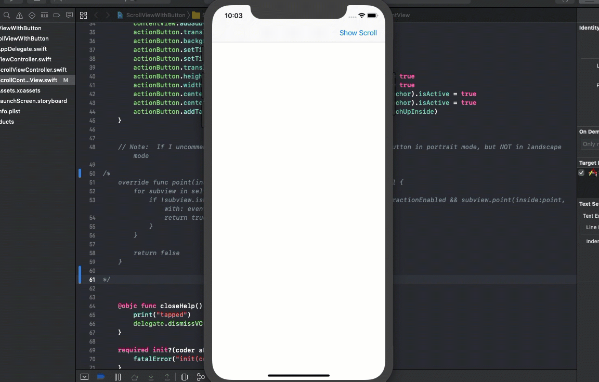

# ScrollViewWIthButton
## Help needed

This sample project demonstrates a viewcontroller (presented modally) that has a scrollview as a subview.

The content of that scrollview is a series of UIViews and on each is a UIButton.

The problem I am having is that **no tap event reaches the Button**.

**Note:**  There is no storyboard or Xib involved.  If I use a storyboard and xib file for my view, it works.

I thought that I had it somewhat resolved when I added the following to the UIView that is used for the scrollview.

```swift
override func point(inside point: CGPoint, with event: UIEvent?) -> Bool {
	for subview in self.subviews as [UIView] {
		if !subview.isHidden && subview.alpha > 0 && 		subview.isUserInteractionEnabled && subview.point(inside:point, with: event) {
			return true
		}
	}
	return false
}
```

This is still not really ideal because of two things.

1. Tapping on the button does not have any visual clue that the button has been tapped
2. When the device is rotated to landscape mode, the scrollview adjusts properly, but the above override function no longer works.

If anyone has a solution for this, please fork the project and submit a pull request with a fix.  Or, simply contact me and let me know what I am doing wrong.

In this demo, I am madly tapping on the button which is supposed to dismiss the modal viewcontroller by way of a delegate function.